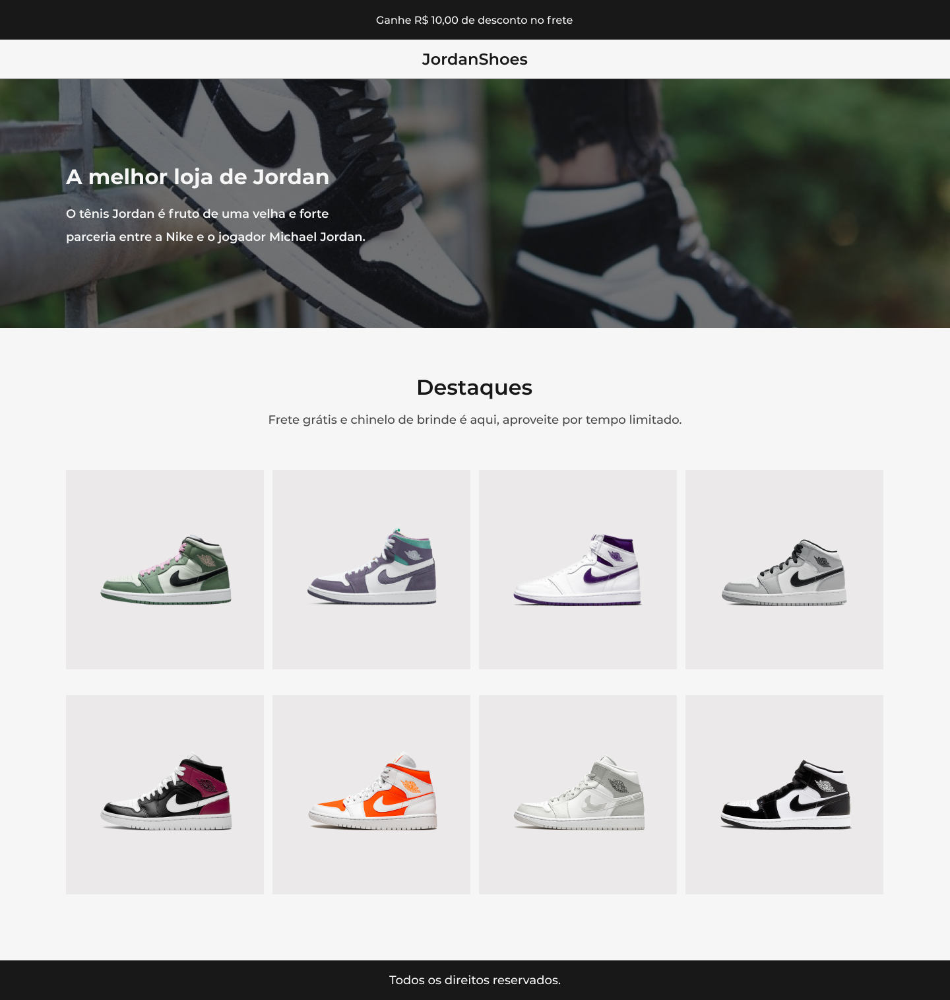

<h1 align="center">
  Codelândia
</h1>

  

<h1 align="center">
    
</h1>

 

## 🧪 Tecnologias

Esse projeto foi desenvolvido com as seguintes tecnologias:

- HTML
- CSS
- Javascript

## 💻 Projeto
O desafio proposto pela Codelândia, tinha como objetivo principal montar uma página contendo uma lista de produtos.

---

Feito com ❤️ por <strong>Letícia Barbosa</strong> 👋🏽 [Entre em contato!](https://www.linkedin.com/in/leticia-pbs/)
